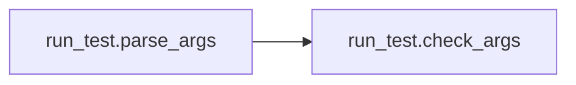
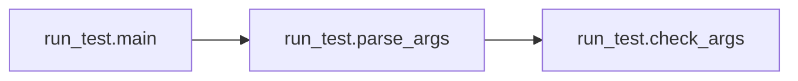

# Key Objects

[_Documentation generated by Documatic_](https://www.documatic.com)

<!---Documatic-section-run_train.parse_args-start--->
## run_train.parse_args

<!---Documatic-section-parse_args-start--->
<!---Documatic-block-run_train.parse_args-start--->
<details>
	<summary><code>run_train.parse_args</code> code snippet</summary>

```python
def parse_args():
    desc = "Tensorflow implementation of 'Image Style Transfer Using Convolutional Neural Networks"
    parser = argparse.ArgumentParser(description=desc)
    parser.add_argument('--vgg_model', type=str, default='pre_trained_model', help='The directory where the pre-trained model was saved', required=True)
    parser.add_argument('--trainDB_path', type=str, default='train2014', help='The directory where MSCOCO DB was saved', required=True)
    parser.add_argument('--style', type=str, default='style/wave.jpg', help='File path of style image (notation in the paper : a)', required=True)
    parser.add_argument('--output', type=str, default='models', help='File path for trained-model. Train-log is also saved here.', required=True)
    parser.add_argument('--content_weight', type=float, default=7.5, help='Weight of content-loss')
    parser.add_argument('--style_weight', type=float, default=500.0, help='Weight of style-loss')
    parser.add_argument('--tv_weight', type=float, default=200.0, help='Weight of total-variance-loss')
    parser.add_argument('--content_layers', nargs='+', type=str, default=['relu4_2'], help='VGG19 layers used for content loss')
    parser.add_argument('--style_layers', nargs='+', type=str, default=['relu1_1', 'relu2_1', 'relu3_1', 'relu4_1', 'relu5_1'], help='VGG19 layers used for style loss')
    parser.add_argument('--content_layer_weights', nargs='+', type=float, default=[1.0], help='Content loss for each content is multiplied by corresponding weight')
    parser.add_argument('--style_layer_weights', nargs='+', type=float, default=[0.2, 0.2, 0.2, 0.2, 0.2], help='Style loss for each content is multiplied by corresponding weight')
    parser.add_argument('--learn_rate', type=float, default=0.001, help='Learning rate for Adam optimizer')
    parser.add_argument('--num_epochs', type=int, default=2, help='The number of epochs to run')
    parser.add_argument('--batch_size', type=int, default=4, help='Batch size')
    parser.add_argument('--checkpoint_every', type=int, default=1000, help='save a trained model every after this number of iterations')
    parser.add_argument('--test', type=str, default=None, help='File path of content image (notation in the paper : x)')
    parser.add_argument('--max_size', type=int, default=None, help='The maximum width or height of input images')
    return check_args(parser.parse_args())
```
</details>
<!---Documatic-block-run_train.parse_args-end--->
<!---Documatic-section-parse_args-end--->

# #
<!---Documatic-section-run_train.parse_args-end--->

<!---Documatic-section-utils.get_img-start--->
## utils.get_img

<!---Documatic-section-get_img-start--->
<!---Documatic-block-utils.get_img-start--->
<details>
	<summary><code>utils.get_img</code> code snippet</summary>

```python
def get_img(src, img_size=False):
    img = scipy.misc.imread(src, mode='RGB')
    if not (len(img.shape) == 3 and img.shape[2] == 3):
        img = np.dstack((img, img, img))
    if img_size != False:
        img = scipy.misc.imresize(img, img_size)
    return img
```
</details>
<!---Documatic-block-utils.get_img-end--->
<!---Documatic-section-get_img-end--->

# #
<!---Documatic-section-utils.get_img-end--->

<!---Documatic-section-run_train.main-start--->
## run_train.main

<!---Documatic-section-main-start--->
<!---Documatic-block-run_train.main-start--->
<details>
	<summary><code>run_train.main</code> code snippet</summary>

```python
def main():
    args = parse_args()
    if args is None:
        exit()
    model_file_path = args.vgg_model + '/' + vgg19.MODEL_FILE_NAME
    vgg_net = vgg19.VGG19(model_file_path)
    content_images = utils.get_files(args.trainDB_path)
    style_image = utils.load_image(args.style)
    CONTENT_LAYERS = {}
    for (layer, weight) in zip(args.content_layers, args.content_layer_weights):
        CONTENT_LAYERS[layer] = weight
    STYLE_LAYERS = {}
    for (layer, weight) in zip(args.style_layers, args.style_layer_weights):
        STYLE_LAYERS[layer] = weight
    sess = tf.Session(config=tf.ConfigProto(allow_soft_placement=True))
    trainer = style_transfer_trainer.StyleTransferTrainer(session=sess, content_layer_ids=CONTENT_LAYERS, style_layer_ids=STYLE_LAYERS, content_images=content_images, style_image=add_one_dim(style_image), net=vgg_net, num_epochs=args.num_epochs, batch_size=args.batch_size, content_weight=args.content_weight, style_weight=args.style_weight, tv_weight=args.tv_weight, learn_rate=args.learn_rate, save_path=args.output, check_period=args.checkpoint_every, test_image=args.test, max_size=args.max_size)
    trainer.train()
    sess.close()
```
</details>
<!---Documatic-block-run_train.main-end--->
<!---Documatic-section-main-end--->

# #
<!---Documatic-section-run_train.main-end--->

<!---Documatic-section-utils.load_image-start--->
## utils.load_image

<!---Documatic-section-load_image-start--->
<!---Documatic-block-utils.load_image-start--->
<details>
	<summary><code>utils.load_image</code> code snippet</summary>

```python
def load_image(filename, shape=None, max_size=None):
    image = PIL.Image.open(filename)
    if max_size is not None:
        factor = float(max_size) / np.max(image.size)
        size = np.array(image.size) * factor
        size = size.astype(int)
        image = image.resize(size, PIL.Image.LANCZOS)
    if shape is not None:
        image = image.resize(shape, PIL.Image.LANCZOS)
    return np.float32(image)
```
</details>
<!---Documatic-block-utils.load_image-end--->
<!---Documatic-section-load_image-end--->

# #
<!---Documatic-section-utils.load_image-end--->

<!---Documatic-section-utils.save_image-start--->
## utils.save_image

<!---Documatic-section-save_image-start--->
<!---Documatic-block-utils.save_image-start--->
<details>
	<summary><code>utils.save_image</code> code snippet</summary>

```python
def save_image(image, filename):
    image = np.clip(image, 0.0, 255.0)
    image = image.astype(np.uint8)
    with open(filename, 'wb') as file:
        PIL.Image.fromarray(image).save(file, 'jpeg')
```
</details>
<!---Documatic-block-utils.save_image-end--->
<!---Documatic-section-save_image-end--->

# #
<!---Documatic-section-utils.save_image-end--->

<!---Documatic-section-vgg19._pool_layer-start--->
## vgg19._pool_layer

<!---Documatic-section-_pool_layer-start--->
<!---Documatic-block-vgg19._pool_layer-start--->
<details>
	<summary><code>vgg19._pool_layer</code> code snippet</summary>

```python
def _pool_layer(input):
    return tf.nn.max_pool(input, ksize=(1, 2, 2, 1), strides=(1, 2, 2, 1), padding='SAME')
```
</details>
<!---Documatic-block-vgg19._pool_layer-end--->
<!---Documatic-section-_pool_layer-end--->

# #
<!---Documatic-section-vgg19._pool_layer-end--->

<!---Documatic-section-run_train.check_args-start--->
## run_train.check_args

<!---Documatic-section-check_args-start--->
<!---Documatic-block-run_train.check_args-start--->
<details>
	<summary><code>run_train.check_args</code> code snippet</summary>

```python
def check_args(args):
    model_file_path = args.vgg_model + '/' + vgg19.MODEL_FILE_NAME
    try:
        assert os.path.exists(model_file_path)
    except:
        print('There is no %s' % model_file_path)
        return None
    try:
        size_in_KB = os.path.getsize(model_file_path)
        assert abs(size_in_KB - 534904783) < 10
    except:
        print("check file size of 'imagenet-vgg-verydeep-19.mat'")
        print('there are some files with the same name')
        print('pre_trained_model used here can be downloaded from bellow')
        print('http://www.vlfeat.org/matconvnet/models/imagenet-vgg-verydeep-19.mat')
        return None
    try:
        assert os.path.exists(args.trainDB_path)
    except:
        print('There is no %s' % args.trainDB_path)
        return None
    try:
        assert os.path.exists(args.style)
    except:
        print('There is no %s' % args.style)
        return None
    dirname = os.path.dirname(args.output)
    try:
        if len(dirname) > 0:
            os.stat(dirname)
    except:
        os.mkdir(dirname)
    try:
        assert args.content_weight > 0
    except:
        print('content weight must be positive')
    try:
        assert args.style_weight > 0
    except:
        print('style weight must be positive')
    try:
        assert args.tv_weight > 0
    except:
        print('total variance weight must be positive')
    try:
        assert len(args.content_layers) == len(args.content_layer_weights)
    except:
        print('content layer info and weight info must be matched')
        return None
    try:
        assert len(args.style_layers) == len(args.style_layer_weights)
    except:
        print('style layer info and weight info must be matched')
        return None
    try:
        assert args.learn_rate > 0
    except:
        print('learning rate must be positive')
    try:
        assert args.num_epochs >= 1
    except:
        print('number of epochs must be larger than or equal to one')
    try:
        assert args.batch_size >= 1
    except:
        print('batch size must be larger than or equal to one')
    try:
        assert args.checkpoint_every >= 1
    except:
        print('checkpoint period must be larger than or equal to one')
    try:
        if args.test is not None:
            assert os.path.exists(args.test)
    except:
        print('There is no %s' % args.test)
        return None
    try:
        if args.max_size is not None:
            assert args.max_size > 0
    except:
        print('The maximum width or height of input image must be positive')
        return None
    return args
```
</details>
<!---Documatic-block-run_train.check_args-end--->
<!---Documatic-section-check_args-end--->

# #
<!---Documatic-section-run_train.check_args-end--->

<!---Documatic-section-run_test.parse_args-start--->
## run_test.parse_args

<!---Documatic-section-parse_args-start--->


### Object Calls

* run_test.check_args

<!---Documatic-block-run_test.parse_args-start--->
<details>
	<summary><code>run_test.parse_args</code> code snippet</summary>

```python
def parse_args():
    desc = "Tensorflow implementation of 'Perceptual Losses for Real-Time Style Transfer and Super-Resolution'"
    parser = argparse.ArgumentParser(description=desc)
    parser.add_argument('--style_model', type=str, default='models/wave.ckpt', help='location for model file (*.ckpt)', required=True)
    parser.add_argument('--content', type=str, default='content/female_knight.jpg', help='File path of content image (notation in the paper : x)', required=True)
    parser.add_argument('--output', type=str, default='result.jpg', help='File path of output image (notation in the paper : y_c)', required=True)
    parser.add_argument('--max_size', type=int, default=None, help='The maximum width or height of input images')
    return check_args(parser.parse_args())
```
</details>
<!---Documatic-block-run_test.parse_args-end--->
<!---Documatic-section-parse_args-end--->

# #
<!---Documatic-section-run_test.parse_args-end--->

<!---Documatic-section-vgg19._conv_layer-start--->
## vgg19._conv_layer

<!---Documatic-section-_conv_layer-start--->
<!---Documatic-block-vgg19._conv_layer-start--->
<details>
	<summary><code>vgg19._conv_layer</code> code snippet</summary>

```python
def _conv_layer(input, weights, bias):
    conv = tf.nn.conv2d(input, tf.constant(weights), strides=(1, 1, 1, 1), padding='SAME')
    return tf.nn.bias_add(conv, bias)
```
</details>
<!---Documatic-block-vgg19._conv_layer-end--->
<!---Documatic-section-_conv_layer-end--->

# #
<!---Documatic-section-vgg19._conv_layer-end--->

<!---Documatic-section-vgg19.preprocess-start--->
## vgg19.preprocess

<!---Documatic-section-preprocess-start--->
<!---Documatic-block-vgg19.preprocess-start--->
<details>
	<summary><code>vgg19.preprocess</code> code snippet</summary>

```python
def preprocess(image, mean_pixel):
    return image - mean_pixel
```
</details>
<!---Documatic-block-vgg19.preprocess-end--->
<!---Documatic-section-preprocess-end--->

# #
<!---Documatic-section-vgg19.preprocess-end--->

<!---Documatic-section-vgg19.undo_preprocess-start--->
## vgg19.undo_preprocess

<!---Documatic-section-undo_preprocess-start--->
<!---Documatic-block-vgg19.undo_preprocess-start--->
<details>
	<summary><code>vgg19.undo_preprocess</code> code snippet</summary>

```python
def undo_preprocess(image, mean_pixel):
    return image + mean_pixel
```
</details>
<!---Documatic-block-vgg19.undo_preprocess-end--->
<!---Documatic-section-undo_preprocess-end--->

# #
<!---Documatic-section-vgg19.undo_preprocess-end--->

<!---Documatic-section-utils.get_files-start--->
## utils.get_files

<!---Documatic-section-get_files-start--->


### Object Calls

* utils.list_files

<!---Documatic-block-utils.get_files-start--->
<details>
	<summary><code>utils.get_files</code> code snippet</summary>

```python
def get_files(img_dir):
    files = list_files(img_dir)
    return list(map(lambda x: os.path.join(img_dir, x), files))
```
</details>
<!---Documatic-block-utils.get_files-end--->
<!---Documatic-section-get_files-end--->

# #
<!---Documatic-section-utils.get_files-end--->

<!---Documatic-section-run_test.main-start--->
## run_test.main

<!---Documatic-section-main-start--->


### Object Calls

* run_test.parse_args

<!---Documatic-block-run_test.main-start--->
<details>
	<summary><code>run_test.main</code> code snippet</summary>

```python
def main():
    args = parse_args()
    if args is None:
        exit()
    content_image = utils.load_image(args.content, max_size=args.max_size)
    soft_config = tf.ConfigProto(allow_soft_placement=True)
    soft_config.gpu_options.allow_growth = True
    sess = tf.Session(config=soft_config)
    transformer = style_transfer_tester.StyleTransferTester(session=sess, model_path=args.style_model, content_image=content_image)
    start_time = time.time()
    output_image = transformer.test()
    end_time = time.time()
    utils.save_image(output_image, args.output)
    shape = content_image.shape
    print('Execution time for a %d x %d image : %f msec' % (shape[0], shape[1], 1000.0 * float(end_time - start_time) / 60))
```
</details>
<!---Documatic-block-run_test.main-end--->
<!---Documatic-section-main-end--->

# #
<!---Documatic-section-run_test.main-end--->

<!---Documatic-section-utils.list_files-start--->
## utils.list_files

<!---Documatic-section-list_files-start--->
<!---Documatic-block-utils.list_files-start--->
<details>
	<summary><code>utils.list_files</code> code snippet</summary>

```python
def list_files(in_path):
    files = []
    for (dirpath, dirnames, filenames) in os.walk(in_path):
        files.extend(filenames)
        break
    return files
```
</details>
<!---Documatic-block-utils.list_files-end--->
<!---Documatic-section-list_files-end--->

# #
<!---Documatic-section-utils.list_files-end--->

<!---Documatic-section-run_train.add_one_dim-start--->
## run_train.add_one_dim

<!---Documatic-section-add_one_dim-start--->
<!---Documatic-block-run_train.add_one_dim-start--->
<details>
	<summary><code>run_train.add_one_dim</code> code snippet</summary>

```python
def add_one_dim(image):
    shape = (1,) + image.shape
    return np.reshape(image, shape)
```
</details>
<!---Documatic-block-run_train.add_one_dim-end--->
<!---Documatic-section-add_one_dim-end--->

# #
<!---Documatic-section-run_train.add_one_dim-end--->

<!---Documatic-section-run_test.check_args-start--->
## run_test.check_args

<!---Documatic-section-check_args-start--->
<!---Documatic-block-run_test.check_args-start--->
<details>
	<summary><code>run_test.check_args</code> code snippet</summary>

```python
def check_args(args):
    try:
        assert os.path.exists(args.style_model + '.index') and os.path.exists(args.style_model + '.meta') and os.path.exists(args.style_model + '.data-00000-of-00001')
    except:
        print('There is no %s' % args.style_model)
        print('Tensorflow r0.12 requires 3 files related to *.ckpt')
        print('If you want to restore any models generated from old tensorflow versions, this assert might be ignored')
        return None
    try:
        assert os.path.exists(args.content)
    except:
        print('There is no %s' % args.content)
        return None
    try:
        if args.max_size is not None:
            assert args.max_size > 0
    except:
        print('The maximum width or height of input image must be positive')
        return None
    dirname = os.path.dirname(args.output)
    try:
        if len(dirname) > 0:
            os.stat(dirname)
    except:
        os.mkdir(dirname)
    return args
```
</details>
<!---Documatic-block-run_test.check_args-end--->
<!---Documatic-section-check_args-end--->

# #
<!---Documatic-section-run_test.check_args-end--->

[_Documentation generated by Documatic_](https://www.documatic.com)